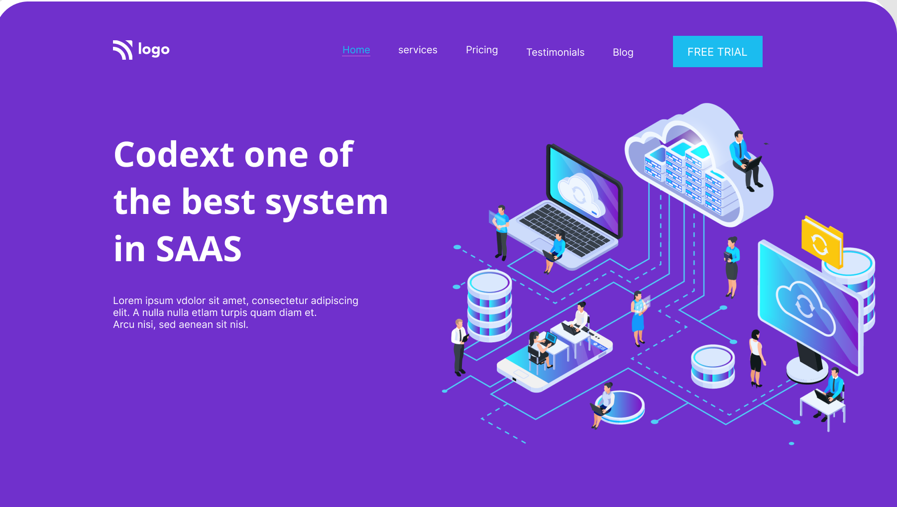
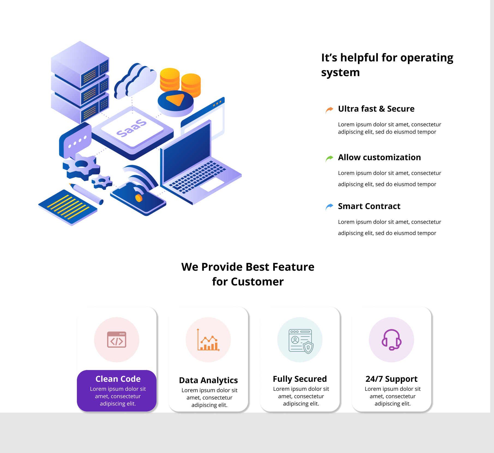

## Firstly, I'd like to thanks [Hitesh Sir](https://twitter.com/Hiteshdotcom) & the team of [iNeuron](https://ineuron.ai) for designing such a beautiful project which made me realise my potential.

## 🚀 About Me
>I'm a front-end developer...

# Hi, I'm shaQuib! 👋

## 🛠 Skills used in building this project
>HTML5 & CSS...

## Name of the Project
***
 > SASS Landing Page
## Time taken to complete this project
> 4.5 hours

## `Learning curve`
***
 - I have learned how to play with the size of svg images.
 - How to implement animation on the image
 - How to contain and make complex card deaign using pure CSS
 - Learned how to zoom-in & zoom-out on hovering of the image.

 - And most importantly the confidence to convert any wireframe into a brautiful web pages.

## `Final Interface`

*** 
- Below are the some screen shots how does this web app page looks like while running on the browser.

